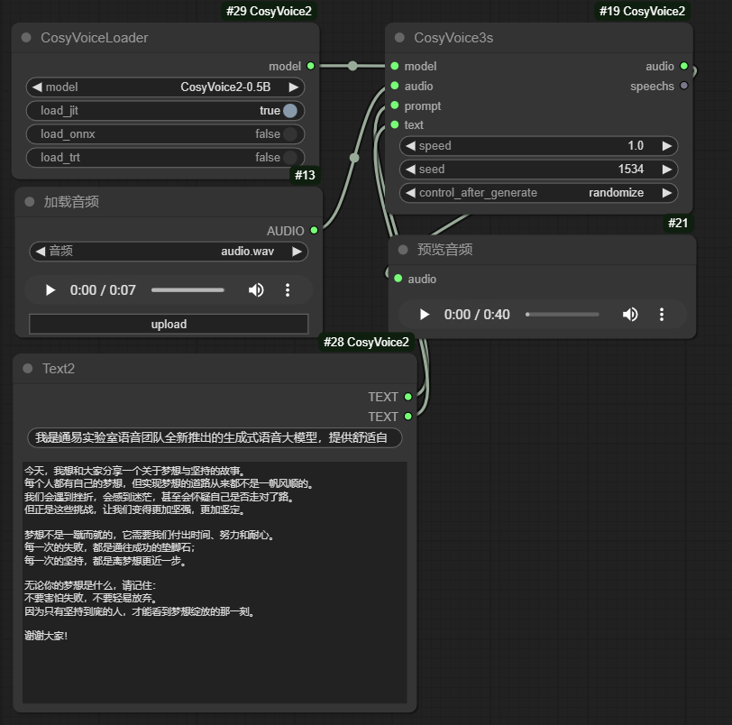

# CosyVoice2_ComfyUI
A plugin of ComfyUI for [CosyVoice2](https://github.com/FunAudioLLM/CosyVoice),   
one component for text to [long Sonic video](https://github.com/benda1989/Sonic_ComfyUI.git) in ComfyUI.
## Installation
In the ./ComfyUI/custom_node directory, run the following:
```sh
git clone https://github.com/benda1989/CosyVoice2_ComfyUI.git
cd CosyVoice2_ComfyUI
conda install -y -c conda-forge pynini==2.1.5
pip install -r requirements.txt
# If you encounter sox compatibility issues
# ubuntu
sudo apt-get install sox libsox-dev
# centos
sudo yum install sox sox-devel 
```
## Copy models
By default project will download CosyVoice2-0.5B and CosyVoice-ttsfrd into pretrained_models,  
You can copy it there if you downloaded before.  
file tree looks like this at least:
```sh
--  ComfyUI/custom_node/CosyVoice2_ComfyUI/pretrained_models
    |-- CosyVoice2-0.5B
    |-- CosyVoice-ttsfrd
```
## Example

